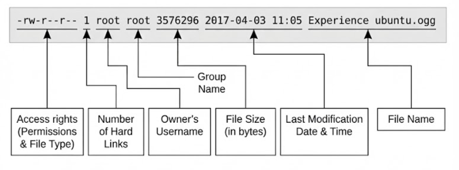

# Exploring the System

The commands used to explore the Linux file system structure and file contents, along with the concepts of file metadata and links.

**Core System Exploration Commands**

| Command | Description                                                                          |
| ------- | ------------------------------------------------------------------------------------ |
| `ls`    | List directory contents.                                                             |
| `file`  | Determine the file type.                                                             |
| `less`  | A program (or "pager") used to view text files, allowing easy viewing and scrolling. |

## Options and Arguments

Commands are often followed by one or more _options_ that modify their behavior, and further, by one or more _arguments_, the items upon which the command acts.

```bash
command [OPTIONS] ARGUMENTS
```

- Short options: a single character preceded by a dash. Many commands allow multiple short options to be strung together
- Long options: a word preceded by 2 dashes

## Listing the Contents of a Directory

To list the files and directories in the current working directory, we use the `ls` command.

```bash
ls
```

Besides the current working directory, we can specify the directory to list.

```bash
ls /usr
```

We can even specify multiple directories.

```bash
ls ~ /usr
```

Changing the output to long format

```bash
ls -l
```

**Common** `ls` **Options**

| Option | Long Option        | Meaning                                                                                                                                                                                                                           |
| ------ | ------------------ | --------------------------------------------------------------------------------------------------------------------------------------------------------------------------------------------------------------------------------- |
| `-a`   | `--all`            | List all files, even those with names that begin with a period, which are normally not listed(that is, hidden).                                                                                                                   |
| `-A`   | `--almost-all`     | Like the -a option above except it does not list `.` (current directory) and `..` (parent directory).                                                                                                                             |
| `-d`   | `--directory`      | Ordinarily, if a directory is specified, `ls` will list the contents of the directory, not the directory itself. Use this option in conjunction with the `-l` option to see details about the directory rather than its contents. |
| `-F`   | `--classify`       | This option will append an indicator character to the end of each listed name. For example, a forward slash (`/`) if the name is a directory.                                                                                     |
| `-h`   | `--human-readable` | In long format listings, display file sizes in human readable format rather than in bytes.                                                                                                                                        |
| `-l`   |                    | Display results in long format.                                                                                                                                                                                                   |
| `-r`   | `--reverse`        | Display the results in reverse order. Normally, `ls` displays its results in ascending alphabetical order.                                                                                                                        |
| `-S`   |                    | Sort results by file size.                                                                                                                                                                                                        |
| `-t`   |                    | Sort by modification time.                                                                                                                                                                                                        |

A Longer Look at Long Format



> **inode**
>
> **inode** is a data structure in a filesystem that stores **metadata about a file**, such as permissions, owner, size, timestamps, and pointers to the file’s actual data blocks.
>
> - The **filename** is just a label pointing to the inode.
> - The **inode** contains all metadata and the location of the file’s content.
> - Multiple filenames (hard links) can point to the **same inode**, sharing the same content and metadata.
>
> `filename → inode → actual file content (data blocks)`

## Determining a File’s Type with `file`

We will use the `file` command to determine a file's type.

```bash
file FILE_NAME
```

> Everything is a file.

## Viewing File Contents with less

The `less` command is a program to view text files. Why would we want to examine text files? Because many of the files that contain system settings (called configuration files) are stored in this format, and being able to read them gives us insight about how the system works. In addition, some of the actual programs that the system uses (called scripts) are stored in this format.

The usage of `less` command:

```bash
less FILENAME
```

`less` allows scrolling both forward and backward through a text file.

| Command                  | Action                                                 |
| ------------------------ | ------------------------------------------------------ |
| `q`                      | Quit less.                                             |
| **Page Up** or `b`       | Scroll back one page.                                  |
| **Page Down** or `space` | Scroll forward one page.                               |
| **Up Arrow** or `k`      | Scroll up one line.                                    |
| **Down Arrow** or `j`    | Scroll down one line.                                  |
| `G`                      | Move to the end of the text file.                      |
| `1G` or `g`              | Move to the beginning of the text file.                |
| `/CHARACTERS`            | Search forward to the next occurrence of `characters`. |
| `n`                      | Search for the next occurrence of the previous search  |

**System Guided Tour (Key Directories)**

The Linux file system layout generally follows the **Linux Filesystem Hierarchy Standard**.

| Directory      | Description                                                                                                                                                                                                                                                                                                                                               |
| -------------- | --------------------------------------------------------------------------------------------------------------------------------------------------------------------------------------------------------------------------------------------------------------------------------------------------------------------------------------------------------- |
| **/**          | The root directory. Where everything begins.                                                                                                                                                                                                                                                                                                              |
| **/bin**       | Contains binaries (programs) that must be present for the system to boot and run.                                                                                                                                                                                                                                                                         |
| **/dev**       | This is a special directory that contains device nodes. “Everything is a file” also applies to devices. Here is where the kernel maintains a list of all the devices it understands.                                                                                                                                                                      |
| **/etc**       | The /etc directory contains all of the system-wide configuration files. It also contains a collection of shell scripts that start each of the system services at boot time. Everything in this directory should be readable text.                                                                                                                         |
| **/lib**       | Contains shared library files used by the core system programs. These are similar to dynamic link libraries (DLLs) in Windows.                                                                                                                                                                                                                            |
| **/media**     | On modern Linux systems the **/media** directory will contain the mount points for removable media such as USB drives, CD-ROMs, etc. that are mounted automatically at insertion.                                                                                                                                                                         |
| **/opt**       | The **/opt** directory is used to install “optional” software. This is mainly used to hold commercial software products that might be installed on the system.                                                                                                                                                                                            |
| **/sbin**      | This directory contains “system“ binaries. These are programs that perform vital system tasks that are generally reserved for the _superuser_.                                                                                                                                                                                                            |
| **/tmp**       | The **/tmp** directory is intended for the storage of temporary, transient files created by various programs. Some configurations cause this directory to be emptied each time the system is rebooted.                                                                                                                                                    |
| **/usr**       | The **/usr** directory tree is likely the largest one on a Linux system. It contains all the programs and support files used by regular users.                                                                                                                                                                                                            |
| **/usr/bin**   | **/usr/bin** contains the executable programs installed by the Linux distribution. It is not uncommon for this directory to hold thousands of programs.                                                                                                                                                                                                   |
| **/usr/lib**   | The shared libraries for the programs in **/usr/bin**.                                                                                                                                                                                                                                                                                                    |
| **/usr/local** | The **/usr/local** tree is where programs that are not included with the distribution but are intended for system-wide use are installed. Programs compiled from source code are normally installed in **/usr/local/bin**. On a newly installed Linux system, this tree exists, but it will be empty until the system administrator puts something in it. |
| **/usr/sbin**  | Contains more system administration programs.                                                                                                                                                                                                                                                                                                             |
| **/usr/share** | **/usr/share** contains all the shared data used by programs in **/usr/bin**. This includes things such as default configuration files, icons, screen backgrounds, sound files, etc.                                                                                                                                                                      |
