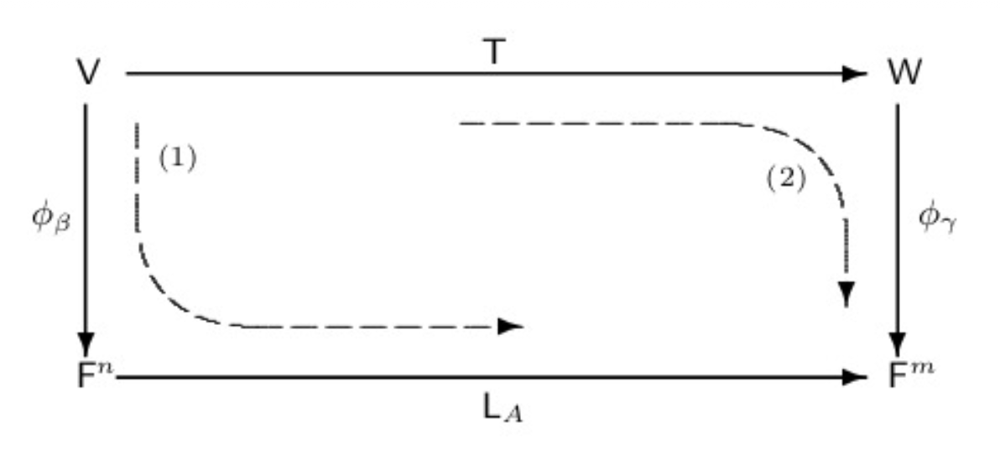

# Linear Transformations and Matrices

## 2.1 Linear Transformations, Null Spaces, and Ranges

### Formal Definition of a Linear Transformation

#### Definition

::: info Definition
Let $\mathsf{V}$ and $\mathsf{W}$ be vector spaces over the same field $F$.
A function $\mathsf{T}: \mathsf{V} \to \mathsf{W}$ is called a **linear transformation** from $\mathsf{V}$ to $\mathsf{W}$ if, for all $x, y \in \mathsf{V}$ and $c \in F$, we have:

1. $\mathsf{T}(x + y) = \mathsf{T}(x) + \mathsf{T}(y)$
2. $\mathsf{T}(cx) = c\mathsf{T}(x)$

:::

We often simply call $\mathsf{T}$ **linear**.

#### Properties of Linear Transformations

$\mathsf{T}: \mathsf{V} \to \mathsf{W}$:

1. If $\mathsf{T}$ is linear, then $\mathsf{T}(\mathbf{0}_\mathsf{V}) = \mathbf{0}_\mathsf{W}$
2. $\mathsf{T}$ is linear if and only if $\mathsf{T}(cx + y) = c\mathsf{T}(x) + \mathsf{T}(y)$ for all $x, y \in \mathsf{V}$ and $c \in F$
3. If $\mathsf{T}$ is linear, $\mathsf{T}(x - y) = \mathsf{T}(x) - \mathsf{T}(y)$ for all $x, y \in \mathsf{V}$
4. T is linear if and only if, for $x_1, x_2, \dots, x_n \in \mathsf{V}$ and $a_1, a_2, \dots, a_n \in F$, we have
   $$
   \mathsf{T}(\sum_{i=1}^n a_i x_i) = \sum_{i=1}^n a_i \mathsf{T}(x_i)
   $$

> We often use property 2 to prove that a given transformation is linear.

#### Identity and Zero Transformation

- **Identity transformation**: $\mathsf{I}_\mathsf{V}: \mathsf{V} \to \mathsf{V}$ defined by $\mathsf{I}_\mathsf{V}(x) = x$ for all $x \in \mathsf{V}$
- **Zero transformation**: $\mathsf{T}_\mathsf{0}: \mathsf{V} \to \mathsf{W}$ defined by $\mathsf{T}_\mathsf{0}(x) = \mathbf{0}_\mathsf{W}$ for all $x \in \mathsf{V}$

### Null Spaces and Ranges

::: info Definition
Let $\mathsf{V}$ and $\mathsf{W}$ be vector spaces, and let $\mathsf{T}: \mathsf{V} \to \mathsf{W}$ be a linear transformation.

- The **null space** (or **kernel**) of $\mathsf{T}$, denoted by $\mathsf{N}(\mathsf{T})$, is the set of all vectors $x \in \mathsf{V}$ such that $\mathsf{T}_{0}(x) = \mathbf{0}$:
  $$
  \mathsf{N}(\mathsf{T}) = \{x \in \mathsf{V} : \mathsf{T}(x) = \mathbf{0}\}
  $$
- The **range** (or **image**) of $\mathsf{T}$, denoted by $\mathsf{R}(\mathsf{T})$, is the subset of $\mathsf{W}$ consisting of all images (under $\mathsf{T}$) of vectors in $\mathsf{V}$:
  $$
  \mathsf{R}(\mathsf{T}) = \{\mathsf{T}(x) : x \in \mathsf{V}\}
  $$

:::

> Let $\mathsf{V}$ and $\mathsf{W}$ be vector spaces, and let $\mathsf{I}_\mathsf{V}: \mathsf{V} \to \mathsf{V}$ and $\mathsf{T}_\mathsf{0}: \mathsf{V} \to \mathsf{W}$ be identity and zero transformations, respectively.
> Then $\mathsf{N}(\mathsf{I}) = \{\mathbf{0}\}$, $\mathsf{R}(\mathsf{I}) = \mathsf{V}$, $\mathsf{N}(\mathsf{T}_\mathsf{0}) = \mathsf{V}$, and $\mathsf{R}(\mathsf{T}_\mathsf{0}) = \{\mathbf{0}\}$.

::: info Theorem 2.1
Let $\mathsf{V}$ and $\mathsf{W}$ be vector spaces, and let $\mathsf{T}: \mathsf{V} \to \mathsf{W}$ be linear.
Then $\mathsf{N}(\mathsf{T})$ is a subspace of $\mathsf{V}$ and $\mathsf{R}(\mathsf{T})$ is a subspace of $\mathsf{W}$.
:::

::: info Theorem 2.2
Let $\mathsf{V}$ and $\mathsf{W}$ be vector spaces, and let $\mathsf{T}: \mathsf{V} \to \mathsf{W}$ be linear.
If $\beta = \{v_1, v_2, \dots, v_n\}$ is a basis for $\mathsf{V}$, then
$$\mathsf{R}(\mathsf{T}) = \text{span}(\mathsf{T}(\beta)) = \text{span}(\{\mathsf{T}(v_1), \mathsf{T}(v_2), \dots, \mathsf{T}(v_n)\})$$
:::

> It should be noted that Theorem 2.2 is true if $\beta$ is infinite, that is, $\mathsf{R}(\mathsf{T}) = span(\{\mathsf{T}(v):v \in \beta\})$.

### Rank and Nullity (The Dimension Theorem)

::: info Definition
Let $\mathsf{V}$ and $\mathsf{W}$ be vector spaces, and let $\mathsf{T}: \mathsf{V} \to \mathsf{W}$ be linear.
If $\mathsf{N}(\mathsf{T})$ and $\mathsf{R}(\mathsf{T})$ are finite-dimensional, then:

- The **nullity** of $\mathsf{T}$, denoted by $\text{nullity}(\mathsf{T})$, is the dimension of $\mathsf{N}(\mathsf{T})$.
- The **rank** of $\mathsf{T}$, denoted by $\text{rank}(\mathsf{T})$, is the dimension of $\mathsf{R}(\mathsf{T})$.

:::

::: info Theorem 2.3 (The Dimension Theorem).
Let $\mathsf{V}$ and $\mathsf{W}$ be vector spaces, and let $\mathsf{T}: \mathsf{V} \to \mathsf{W}$ be linear.
If $\mathsf{V}$ is finite-dimensional, then

$$
\text{rank}(\mathsf{T}) + \text{nullity}(\mathsf{T}) = \text{dim}(\mathsf{V})
$$

:::

> The Dimension Theorem (also known as the Rank-Nullity Theorem) represents a law of conservation of dimensions.
> The total dimension of the domain $\mathsf{V}$ is split into two parts: the dimensions that collapse to zero ($\text{nullity}(\mathsf{T})$) and the dimensions that survive to span the output space ($\text{rank}(\mathsf{T})$).

### One-to-One and Onto Linear Transformations

::: info Theorem 2.4
Let $\mathsf{V}$ and $\mathsf{W}$ be vector spaces, and let $\mathsf{T}: \mathsf{V} \to \mathsf{W}$ be linear.
Then $\mathsf{T}$ is one-to-one if and only if $\mathsf{N}(\mathsf{T}) = \{\mathbf{0}\}$.
:::

::: info Theorem 2.5
Let $\mathsf{V}$ and $\mathsf{W}$ be finite-dimensional vector spaces such that $\text{dim}(\mathsf{V}) = \text{dim}(\mathsf{W})$, and let $\mathsf{T}: \mathsf{V} \to \mathsf{W}$ be linear.
Then the following are equivalent:

1. $\mathsf{T}$ is one-to-one.
2. $\mathsf{T}$ is onto.
3. $\text{rank}(\mathsf{T}) = \text{dim}(\mathsf{V})$.

:::

> Note that when $\text{dim}(\mathsf{V}) \neq \text{dim}(\mathsf{W})$:
>
> - if $\text{dim}(\mathsf{V}) < \text{dim}(\mathsf{W})$, then $\mathsf{T}$ cannot be onto.
> - if $\text{dim}(\mathsf{V}) > \text{dim}(\mathsf{W})$, then $\mathsf{T}$ cannot be one-to-one.
>
> If $\mathsf{V}$ is not finite-dimensional and $\mathsf{T}:\mathsf{V} \to \mathsf{V}$ is linear, then it does not follow that one-to-ont and onto are equivalent.

### Determining a Linear Transformation by a Basis

::: info Theorem 2.6
Let $\mathsf{V}$ and $\mathsf{W}$ be vector spaces over $F$, and let $\{v_1, v_2, \dots, v_n\}$ be a basis for $\mathsf{V}$.
For any vectors $w_1, w_2, \dots, w_n$ in $\mathsf{W}$, there exists a **unique** linear transformation $\mathsf{T}: \mathsf{V} \to \mathsf{W}$ such that

$$
\mathsf{T}(v_i) = w_i \quad \text{for } i = 1, 2, \dots, n
$$

:::

> This theorem establishes that a linear transformation is completely and uniquely determined by its action on a basis of the domain.
> This provides the mathematical foundation for representing linear transformations as matrices.

::: info Theorem 2.6 Corollary
Let $\mathsf{V}$ and $\mathsf{W}$ be vector spaces, and suppose that $\mathsf{V}$ has a finite basis $\{v_1, v_2, \dots, v_n\}$.
If $\mathsf{U}, \mathsf{T}:\mathsf{V} \to \mathsf{W}$ are linear and $\mathsf{U}(v_i) = \mathsf{T}(v_i)$ for $i = 1, 2, \dots, n$, then $\mathsf{U} = \mathsf{T}$.
:::

## 2.2 The Matrix Representation of a Linear Transformation

### Ordered Bases and Coordinate Vectors

To bridge abstract linear transformations with concrete matrix operations, we must fix an order for the basis vectors in our spaces.

::: info Definition: Ordered Basis
Let $\mathsf{V}$ be a finite-dimensional vector space. An **ordered basis** for $\mathsf{V}$ is a basis for $\mathsf{V}$ endowed with a specific order. That is, an ordered basis is a finite sequence of linearly independent vectors that spans $\mathsf{V}$.
:::

We call $\{e_1, e_2, \dots, e_n\}$ the **standared ordered basis** for the vector space $\mathsf{F}^n$.
Also, we call $\{1, x, \dots, x^n\}$ the **standared ordered basis** for the vector space $\mathsf{P}_n(F)$.

::: info Definition: Coordinate Vector
Let $\beta = \{u_1, u_2, \dots, u_n\}$ be an ordered basis for a finite-dimensional vector space $\mathsf{V}$. For any $x \in \mathsf{V}$, there exist unique scalars $a_1, a_2, \dots, a_n \in F$ such that:
$$x = \sum_{i=1}^n a_i u_i$$
We define the **coordinate vector** of $x$ relative to $\beta$, denoted by $[x]_\beta$, as the column vector:
$$[x]_\beta = \begin{pmatrix} a_1 \\ a_2 \\ \vdots \\ a_n \end{pmatrix}$$
:::

> Notice that $[u_i]_\beta = e_i$ in the preceding definition.
> The correspondence $x \to [x]_{\beta}$ provides us with a linear transformation from $\mathsf{V}$ to $\mathsf{}$

### Matrix Representation of a Linear Transformation

Given ordered bases for both the domain and codomain, every linear transformation can be represented as a matrix.

::: info Definition: Matrix Representation $[\mathsf{T}]_\beta^\gamma$
Let $\mathsf{V}$ and $\mathsf{W}$ be finite-dimensional vector spaces with ordered bases $\beta = \{v_1, v_2, \dots, v_n\}$ and $\gamma = \{w_1, w_2, \dots, w_m\}$, respectively.
Let $\mathsf{T}: \mathsf{V} \to \mathsf{W}$ be a linear transformation.

For each $j = 1, 2, \dots, n$, there exist unique scalars $a_{ij} \in F$ ($1 \le i \le m$) such that:
$$\mathsf{T}(v_j) = \sum_{i=1}^m a_{ij} w_i \quad \text{for } 1 \le j \le n$$
We call the $m \times n$ matrix $A$ defined by $A_{ij} = a_{ij}$ the **matrix representation** of $\mathsf{T}$ relative to the ordered bases $\beta$ and $\gamma$, written as:
$$A = [\mathsf{T}]_\beta^\gamma$$
If $\mathsf{V} = \mathsf{W}$ and $\beta = \gamma$, we simplify the notation to $A = [\mathsf{T}]_\beta$.
:::

::: tip Crucial Column Property
The $j$-th column of $[\mathsf{T}]_\beta^\gamma$ is precisely the coordinate vector of $\mathsf{T}(v_j)$ relative to the basis $\gamma$, $[\mathsf{T}(v_j)]_{\gamma}$:
$$[\mathsf{T}]_\beta^\gamma = \begin{pmatrix} [\mathsf{T}(v_1)]_\gamma & [\mathsf{T}(v_2)]_\gamma & \cdots & [\mathsf{T}(v_n)]_\gamma \end{pmatrix}$$
:::

- $\mathsf{T}_0(v_j) = \{\mathbf{0}\} = 0w_1 + 0w_2 + \cdots + 0w_m$ and $[\mathsf{T}_0]_\beta^\gamma = \mathbf{O}$, the $m \times n$ zero matrix.
- $\mathsf{I}_\mathsf{V}(v_j) = v_j = 0v_1 + 0v_2 + \cdots + 0v_{j - 1} + 1v_j + 0v_{j + 1} + \cdots + 0v_n$ and

  $$
  [\mathsf{I}_\mathsf{V}]_\beta =
  \begin{pmatrix}
  1 & 0 & \cdots & 0 \\
  0 & 1 & \cdots & 0 \\
  \vdots & \vdots & \ddots & \vdots \\
  0 & 0 & \cdots & 1
  \end{pmatrix}
  $$

::: info Definition: Kronecker delta $\delta$
We define the **Kronecker delta** $\delta_{ij}$ by $\delta_{ij} = 1$ if $i = j$ and $\delta_{ij} = 0$ if $i \ne j$.
The $n \times n$ identity matrix $I_n$ is defined by $(I_{n})_{ij} = \delta_{ij}$.
That is,

$$
I_n =
\begin{pmatrix}
1 & 0 & \cdots & 0 \\
0 & 1 & \cdots & 0 \\
\vdots & \vdots & \ddots & \vdots \\
0 & 0 & \cdots & 1
\end{pmatrix}
$$

:::

### The Vector Space $\mathcal{L}(\mathsf{V}, \mathsf{W})$

Linear transformations between vector spaces can themselves be added and multiplied by scalars to form a new vector space.

::: info Definition: Addition and Scalar Multiplication
Let $\mathsf{T}, \mathsf{U}: \mathsf{V} \to \mathsf{W}$ be arbitrary functions and let $a \in F$.
We define the sum $T + U: \mathsf{V} \to \mathsf{W}$ and the scalar product $aT: \mathsf{V} \to \mathsf{W}$ by:
$$(T + U)(x) = T(x) + U(x) \quad \text{for all } x \in \mathsf{V}$$
$$(aT)(x) = a T(x) \quad \text{for all } x \in \mathsf{V}$$
:::

::: info Theorem 2.7
Let $\mathsf{V}$ and $\mathsf{W}$ be vector spaces over a field $F$.
And let $\mathsf{T}, \mathsf{U}: \mathsf{V} \to \mathsf{W}$ be linear.

- For all $a \in F$, $a\mathsf{T} + \mathsf{U}$ linear.
- The collection of all linear transformations from $\mathsf{V}$ to $\mathsf{W}$ is a vector space over $F$ under the operations of addition and scalar multiplication defined above.

:::

::: info Definition: Vector space of Linear Transformations
Let $\mathsf{V}$ and $\mathsf{W}$ be vector spaces over a field $F$.
We denote the vector space of all linear transformations from $\mathsf{V}$ into $\mathsf{W}$ by $\mathcal{L}(\mathsf{V}, \mathsf{W})$.
If $\mathsf{V} = \mathsf{W}$, we write $\mathcal{L}(\mathsf{V})$.
:::

### Linearity of the Matrix Representation Map

The assignment of a matrix to a linear transformation preserves addition and scalar multiplication.

::: info Theorem 2.8
Let $\mathsf{V}$ and $\mathsf{W}$ be finite-dimensional vector spaces with ordered bases $\beta$ and $\gamma$, respectively. Let $T, U: \mathsf{V} \to \mathsf{W}$ be linear transformations. Then:

1. $[\mathsf{T} + \mathsf{U}]_\beta^\gamma = [\mathsf{T}]_\beta^\gamma + [\mathsf{U}]_\beta^\gamma$
2. $[a\mathsf{T}]_\beta^\gamma = a [\mathsf{T}]_\beta^\gamma$ for any scalar $a \in F$.

:::

## 2.3 Composition of Linear Transformations and Matrix Multiplication

### Composition of Linear Transformations

The composition of two linear transformations yields another linear transformation, provided their domains and codomains are compatible.

::: info Theorem 2.9
Let $\mathsf{V}, \mathsf{W}$, and $\mathsf{Z}$ be vector spaces over a field $F$.
Let $\mathsf{T}: \mathsf{V} \to \mathsf{W}$ and $\mathsf{U}: \mathsf{W} \to \mathsf{Z}$ be linear transformations.
Then the composition $\mathsf{UT}: \mathsf{V} \to \mathsf{Z}$, defined by $(\mathsf{UT})(x) = \mathsf{U}(\mathsf{T}(x))$ for all $x \in \mathsf{V}$, is a linear transformation.
:::

> Note that We use $\mathsf{U}\mathsf{T}$ rather than $\mathsf{U}\circ\mathsf{T}$ for the composite of linear transformations $\mathsf{U}$ and $\mathsf{T}$.

::: info Theorem 2.10. Algebraic Properties of Composition
Let $\mathsf{V}$ be a vector space over $F$.
Let $\mathsf{T}, \mathsf{U}_1, \mathsf{U}_2 \in \mathcal{L}(\mathsf{V})$. The following properties hold:

- (a) $\mathsf{T}(\mathsf{U}_1 + \mathsf{U}_2) = \mathsf{T}\mathsf{U}_1 + \mathsf{T}\mathsf{U}_2$ and $(\mathsf{U}_1 + \mathsf{U}_2)\mathsf{T} = \mathsf{U}_1\mathsf{T} + \mathsf{U}_2\mathsf{T}$
- (b) $\mathsf{T}(\mathsf{U}_1\mathsf{U}_2) = (\mathsf{TU}_1)\mathsf{U}_2$
- (c) $\mathsf{TI}_\mathsf{V} = \mathsf{I}_\mathsf{V}\mathsf{T} = \mathsf{T}$ (where $\mathsf{I}_\mathsf{V}$ is the identity transformation)
- (d) $a(\mathsf{U}_1\mathsf{U}_2) = (a\mathsf{U}_1)\mathsf{U}_2 = \mathsf{U}_1 (a\mathsf{U}_2)$ for all $a \in F$.

:::

### Matrix Multiplication Defined via Composition

To naturally define matrix multiplication, we require that the product of representation matrices $AB$ equals the matrix representation of the composite transformation $[\mathsf{U}\mathsf{T}]_\alpha^\gamma$.

::: info Computation of Matrix Representation of Composite Transformation
Let $\mathsf{V}, \mathsf{W}$, and $\mathsf{Z}$ be finite-dimensional vector spaces.
Let $\mathsf{T}: \mathsf{V} \to \mathsf{W}$ and $\mathsf{U}: \mathsf{W} \to \mathsf{Z}$ be linear transformations.

Suppose $A = [\mathsf{U}]_\beta^\gamma$ and $B = [\mathsf{T}]_\alpha^\beta$, where:

- $\alpha = \{v_1, v_2, \dots, v_n\}$ is an ordered basis for $\mathsf{V}$.
- $\beta = \{w_1, w_2, \dots, w_m\}$ is an ordered basis for $\mathsf{W}$.
- $\gamma = \{z_1, z_2, \dots, z_p\}$ is an ordered basis for $\mathsf{Z}$.

To determine the matrix $[\mathsf{UT}]_\alpha^\gamma$, we compute $(\mathsf{UT})(v_j)$ for each $j = 1, 2, \dots, n$:

$$
\begin{aligned}
(\mathsf{UT})(v_j) &= \mathsf{U}(\mathsf{T}(v_j)) = \mathsf{U}\left(\sum_{k=1}^m B_{kj} w_k\right) \\
&= \sum_{k=1}^m B_{kj} \mathsf{U}(w_k) \\
&= \sum_{k=1}^m B_{kj} \left(\sum_{i=1}^p A_{ik} z_i\right) \\
&= \sum_{i=1}^p \left(\sum_{k=1}^m A_{ik} B_{kj}\right) z_i \\
&= \sum_{i=1}^p C_{ij} z_i
\end{aligned}
$$

where $C_{ij}$ is the $(i, j)$-entry of $[\mathsf{UT}]_\alpha^\gamma$, defined as:
$$C_{ij} = \sum_{k=1}^m A_{ik} B_{kj}$$
:::

> **Key Takeaway:** This computation directly motivates the standard entry-wise definition of matrix multiplication $(AB)_{ij} = \sum_{k=1}^m A_{ik} B_{kj}$, ensuring that $[\mathsf{UT}]_\alpha^\gamma = [\mathsf{U}]_\beta^\gamma [\mathsf{T}]_\alpha^\beta$.
> A more general result holds for linear transformations that have domains unequal to their codomains.

Matrix multiplication is defined specifically so that the matrix of a composite transformation is the product of the matrices of the individual transformations.

::: info Definition. Matrix Multiplication
Let $A$ be an $m \times n$ matrix and $B$ be an $n \times p$ matrix over $F$. The **product** $AB$ is the $m \times p$ matrix whose $(i, j)$-entry is given by:
$$(AB)_{ij} = \sum_{k=1}^n A_{ik} B_{kj} \quad \text{for } 1 \le i \le m \text{ and } 1 \le j \le p$$
:::

::: info Theorem 2.11. Matrix Representation of Composition
Let $\mathsf{V}, \mathsf{W}$, and $\mathsf{Z}$ be finite-dimensional vector spaces with ordered bases $\alpha, \beta$, and $\gamma$, respectively.
Let $\mathsf{T}: \mathsf{V} \to \mathsf{W}$ and $\mathsf{U}: \mathsf{W} \to \mathsf{Z}$ be linear transformations. Then:
$$[\mathsf{U}\mathsf{T}]_\alpha^\gamma = [\mathsf{U}]_\beta^\gamma [\mathsf{T}]_\alpha^\beta$$
:::

::: info Theorem 2.11. Corollary
Let $\mathsf{V}$ be a finite-dimensional vector space with an ordered basis $\beta$.
Let $\mathsf{T}, \mathsf{U} \in \mathcal{L}(\mathsf{V})$. Then $[\mathsf{UT}]_\beta = [\mathsf{U}]_\beta[\mathsf{T}]_\beta$.
:::

### Column-Wise View of Matrix Multiplication

::: info Theorem 2.13
Let $A$ be an $m \times n$ matrix and $B$ be an $n \times p$ matrix. For each $j = 1, 2, \dots, p$, let $u_j$ and $v_j$ denote the $j$-th columns of $AB$ and $B$, respectively.
Then:

1. $u_j = A v_j$
2. $v_j = B e_j$, where $e_j$ is the $j$-th standard vector of $\mathsf{F}^p$.
   :::

It follows that column $j$ of $AB$ is a linear comination of the columns of $A$ with the coefficients in the linear combination being the entries of column $j$ of $B$.
An analogous result holds for rows; that is, row $i$ of $AB$ is a linear combination of the rows of $B$ with the coefficients in the linear combination being the entries of row $i$ of $A$.

### Computing Transformation Images via Matrix-Vector Multiplication

Matrix multiplication allows us to compute the image of any vector under a linear transformation using coordinate vectors.

::: info Theorem 2.14
Let $\mathsf{V}$ and $\mathsf{W}$ be finite-dimensional vector spaces with ordered bases $\beta$ and $\gamma$, respectively.
Let $\mathsf{T}: \mathsf{V} \to \mathsf{W}$ be a linear transformation.
Then for each $v \in \mathsf{V}$, we have:
$$[\mathsf{T}(v)]_\gamma = [\mathsf{T}]_\beta^\gamma [v]_\beta$$
:::

> **Intuition:** To find the coordinate representation of $\mathsf{T}(v)$ in the target basis $\gamma$, simply multiply the matrix representation $[\mathsf{T}]_\beta^\gamma$ by the coordinate vector $[v]_\beta$.

### Left-Multiplication Transformation $L_A$

Every $m \times n$ matrix defines a canonical linear transformation between concrete coordinate spaces $\mathsf{F}^n$ and $\mathsf{F}^m$.

::: info Definition: Left-Multiplication Transformation
Let $A \in M_{m \times n}(F)$. We define the **left-multiplication transformation** $\mathsf{L}_A: \mathsf{F}^n \to \mathsf{F}^m$ by:
$$\mathsf{L}_A(x) = Ax \quad \text{for each column vector } x \in \mathsf{F}^n$$
:::

::: info Theorem 2.15: Properties of $\mathsf{L}_A$
Let $A, B \in M_{m \times n}(F)$ and $C \in M_{n \times p}(F)$.
Then $\mathsf{L}_A: F^n \to F^m$ is a linear transformation.
Let $\beta$ and $\gamma$ be the standard ordered bases for $\mathsf{F}^n$ and $\mathsf{F}^m$, respectively.

- (a) $[\mathsf{L}_A]_\beta^\gamma = A$.
- (b) $\mathsf{L}_A = \mathsf{L}_B$ if and only if $A = B$.
- (c) $\mathsf{L}_{A+B} = \mathsf{L}_A + \mathsf{L}_B$ and $\mathsf{L}_{aA} = a \mathsf{L}_A$ for all $a \in F$.
- (d) If $\mathsf{T} : \mathsf{F}_n \to \mathsf{F}_m$ is linear, then there exists a unique $m \times n$ matrix $C$ such that $\mathsf{T} = \mathsf{L}_C$. In fact, $C = [\mathsf{T}]_\beta^\gamma$.
- (e) If $E$ is an $n \times p$ matrix, then $L_{AE} = \mathsf{L}_A \mathsf{L}_E$.
- (f) If $m = n$, then $\mathsf{L}_{I_{n}} = \mathsf{I}_{\mathsf{F}^n}$

:::

### Algebraic Properties of Matrix Multiplication

By leveraging the connection between matrices and linear transformations ($\mathsf{L}_A$), algebraic properties of matrix multiplication follow naturally from those of linear transformations.

::: info Theorem 2.12.
Let $A \in M_{m \times n}(F), B, C \in M_{n \times p}(F)$ and $D, E \in M_{q \times m}(F)$

1. $A(B + C) = AB + AC$ and $(D + E)A = DA + EA$ (Distributivity)
2. $a(AB) = (aA)B = A(aB)$ for any scalar $a \in F$.
3. $I_m A = A = A I_n$ (where $I_k$ denotes the $k \times k$ identity matrix).

:::

::: info Theorem 2.12. Corollary. Linearity of Matrix Multiplication
Let $A$ be an $m \times n$ matrix, $B_1, B_2, \dots, B_k$ be $n \times p$ matrices, $C_1, C_2, \dots, C_k$ be $q \times m$ matrices, and $a_1, a_2, \dots, a_k$ be scalars.
Then:

$$A \left( \sum_{i=1}^k a_i B_i \right) = \sum_{i=1}^k a_i A B_i$$

and

$$\left( \sum_{i=1}^k a_i C_i \right) A = \sum_{i=1}^k a_i C_i A$$
:::

::: info Theorem 2.16
Let $A \in M_{m \times n}(F)$, $B \in M_{n \times p}(F)$ and $C \in M_{p \times q}(F)$, then

$$
A(BC) = (AB)C
$$

That is, matrix multiplication is associative.

:::

## 2.4 Invertibility and Isomorphisms

### Invertibility of Linear Transformations

::: info Definition: Invertible Linear Transformation
Let $\mathsf{V}$ and $\mathsf{W}$ be vector spaces, and let $\mathsf{T}: \mathsf{V} \to \mathsf{W}$ be linear.
A function $\mathsf{U}: \mathsf{W} \to \mathsf{V}$ is said to be an **inverse** of $\mathsf{T}$ if $\mathsf{TU} = \mathsf{I}_\mathsf{W}$ and $\mathsf{UT} = \mathsf{I}_\mathsf{V}$.
If $\mathsf{T}$ has an inverse, then $\mathsf{T}$ is said to be **invertible**.
The inverse of $\mathsf{T}$ is unique and is denoted by $\mathsf{T}^{-1}$.

**Fundamental Properties:**

1. $(\mathsf{TU})^{-1} = \mathsf{U}^{-1}\mathsf{T}^{-1}$.
2. $(\mathsf{T}^{-1})^{-1} = \mathsf{T}$; in particular, $\mathsf{T}^{-1}$ is invertible.
3. $\mathsf{T}$ is invertible if and only if $\mathsf{T}$ is bijective (both one-to-one and onto).
4. If $\mathsf{V}$ and $\mathsf{W}$ are finite-dimensional spaces with $\text{dim}(\mathsf{V}) = \text{dim}(\mathsf{W})$, then $\mathsf{T}$ is invertible if and only if $\text{rank}(\mathsf{T}) = \text{dim}(\mathsf{V})$ (i.e., $\text{nullity}(\mathsf{T}) = 0$).

:::

::: info Theorem 2.17. Linearity of Inverse Mappings
Let $\mathsf{V}$ and $\mathsf{W}$ be vector spaces, and let $\mathsf{T}: \mathsf{V} \to \mathsf{W}$ be linear and invertible.
Then $\mathsf{T}^{-1}: \mathsf{W} \to \mathsf{V}$ is linear.
:::

::: info Theorem 2.17. Corollary
Let $\mathsf{T}$ be an invertible linear transformation from $\mathsf{V}$ to $\mathsf{W}$. Then $\mathsf{V}$ is finite-dimensional if and only if $\mathsf{W}$ is finite-dimensional. In this case, $\dim(\mathsf{V}) = \dim(\mathsf{W})$.
:::

> It now follows immediately from Theorem 2.5, we can now conclude that if $\mathsf{T}$ is a linear transformation between vector spaces of equal (finite) dimension, then the following conditions are equivalent:
>
> - T is invertible.
> - T is one-to-one.
> - T is onto.

### Invertibility of Matrices and Matrix Representations

::: info Definition: Invertible Matrix
An $n \times n$ matrix $A$ is **invertible** if there exists an $n \times n$ matrix $B$ such that $AB = BA = I_n$.
The **unique** matrix $B$ is called the **inverse** of $A$ and is denoted by $A^{-1}$.
:::

::: info Theorem 2.18
Let $\mathsf{V}$ and $\mathsf{W}$ be finite-dimensional vector spaces with ordered bases $\beta$ and $\gamma$, respectively.
Let $\mathsf{T}: \mathsf{V} \to \mathsf{W}$ be linear.
Then $\mathsf{T}$ is invertible if and only if $[\mathsf{T}]_\beta^\gamma$ is invertible.
Furthermore:
$$[\mathsf{T}^{-1}]_\gamma^\beta = \left([\mathsf{T}]_\beta^\gamma\right)^{-1}$$
:::

::: info Theorem 2.18. Corollary 1
Let $\mathsf{V}$ be a finite-dimensional vector space with an ordered basis $\beta$, and let $\mathsf{T}: \mathsf{V} \to \mathsf{V}$ be linear.
Then $\mathsf{T}$ is invertible if and only if $[\mathsf{T}]_\beta$ is invertible.
Furthermore, $[\mathsf{T}^{-1}]_\beta = ([\mathsf{T}]_\beta)^{-1}$.
:::

::: info Theorem 2.18 Corollary 2
Let $A$ be an $n \times n$ matrix.
Then $A$ is invertible if and only if $\mathsf{L}_A$ is invertible.
Furthermore, $(\mathsf{L}_A)^{-1} = \mathsf{L}_{A^{-1}}$.
:::

### Isomorphisms Between Vector Spaces

::: info Definition: Isomorphism
Let $\mathsf{V}$ and $\mathsf{W}$ be vector spaces.
We say that $\mathsf{V}$ is **isomorphic** to $\mathsf{W}$ if there exists an invertible linear transformation $\mathsf{T}: \mathsf{V} \to \mathsf{W}$.
Such a linear transformation is called an **isomorphism** from $\mathsf{V}$ onto $\mathsf{W}$.

_(Note: "is isomorphic to" is an equivalence relation on vector spaces.)_
:::

::: info Theorem 2.19.
Let $\mathsf{V}$ and $\mathsf{W}$ be finite-dimensional vector spaces over the same field $F$.
Then $\mathsf{V}$ is isomorphic to $\mathsf{W}$ if and only if $\text{dim}(\mathsf{V}) = \text{dim}(\mathsf{W})$.
:::

::: info Theorem 2.19. Corollary
Let $\mathsf{V}$ be a vector space over $F$. Then $\mathsf{V}$ is isomorphic to $\mathsf{F}^n$ if and only if $\dim(\mathsf{V}) = n$.
:::

> **Structural Insight:** Every $n$-dimensional vector space over $F$ is algebraically identical to $\mathsf{F}^n$.
> The concrete nature of the vectors (matrices, polynomials, etc.) does not affect their linear algebraic structure.

### The Vector Space Isomorphism $\mathcal{L}(\mathsf{V}, \mathsf{W}) \cong M_{m \times n}(F)$

::: info Theorem 2.20
Let $\mathsf{V}$ and $\mathsf{W}$ be finite-dimensional vector spaces over $F$ of dimensions $n$ and $m$, respectively, and let $\beta$ and $\gamma$ be ordered bases for $\mathsf{V}$ and $\mathsf{W}$, respectively.
Then the function $\Phi_\beta^\gamma: \mathcal{L}(\mathsf{V}, \mathsf{W}) \to M_{m \times n}(F)$ defined by:
$$\Phi_\beta^\gamma(\mathsf{T}) = [\mathsf{T}]_\beta^\gamma \quad \text{for } \mathsf{T} \in \mathcal{L}(\mathsf{V}, \mathsf{W})$$
is an isomorphism.
:::

::: info Theorem 2.20 Corollary
Let $\mathsf{V}$ and $\mathsf{W}$ be finite-dimensional vector spaces of dimensions $n$ and $m$, respectively.
Then $\mathcal{L}(\mathsf{V}, \mathsf{W})$ is finite-dimensional with:
$$\dim(\mathcal{L}(\mathsf{V}, \mathsf{W})) = mn$$
:::

### Standard Representation and the Commutative Diagram

::: info Definition: Standard Representation $\phi_\beta$
Let $\beta$ be an ordered basis for an $n$-dimensional vector space $\mathsf{V}$ over $F$.
The **standard representation** of $\mathsf{V}$ with respect to $\beta$ is the function $\phi_\beta: \mathsf{V} \to \mathsf{F}^n$ defined by:
$$\phi_\beta(x) = [x]_\beta \quad \text{for each } x \in \mathsf{V}$$
:::

::: info Theorem 2.21
For any finite-dimensional vector space $\mathsf{V}$ with ordered basis $\beta$, the standard representation $\phi_\beta$ is an isomorphism.
:::

#### The Commutative Diagram

Let $\mathsf{T}: \mathsf{V} \to \mathsf{W}$ be a linear transformation between finite-dimensional spaces with ordered bases $\beta$ and $\gamma$, respectively.
Let $A = [T]_\beta^\gamma$. We have:

1. Map $\mathsf{V}$ into $\mathsf{F}_n$ with $\phi_\beta$ and follow this transformation with $\mathsf{L}_A$; this yields the composite $\mathsf{L}_{A}\phi_{\beta}$.
2. Map $\mathsf{V}$ into $\mathsf{W}$ with $\mathsf{T}$ and follow it by $\phi_\gamma$ to obtain the composite $\phi_\gamma\mathsf{T}$.

Then:

$$\mathsf{L}_A \phi_\beta = \phi_\gamma T$$

